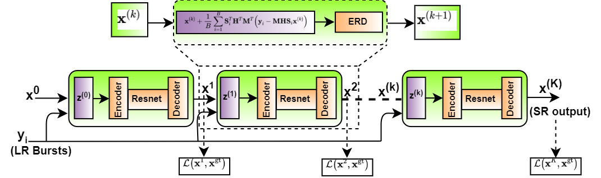
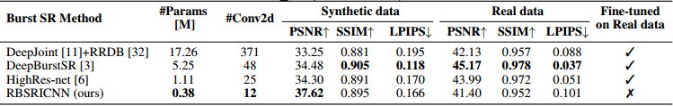
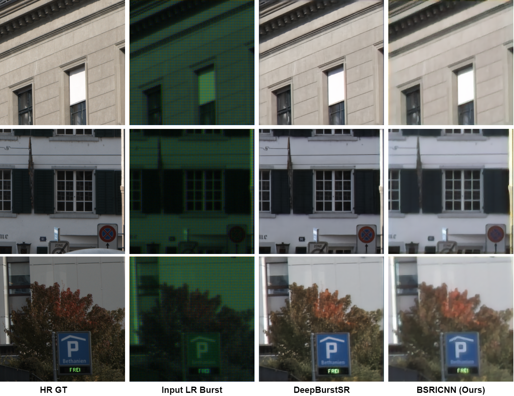

# RBSRICNN: Raw Burst Super-Resolution through Iterative Convolutional Neural Network


An official PyTorch implementation of the [RBSRICNN](https://github.com/RaoUmer/RBSRICNN) network as described in the paper **[RBSRICNN: Raw Burst Super-Resolution through Iterative Convolutional Neural Network](https://arxiv.org/abs/2110.13217)** which is published in the **[Machine Learning and the Physical Sciences workshop](https://ml4physicalsciences.github.io/2021/)** at the 35th Conference on Neural Information Processing Systems (NeurIPS), 2021.

___________

* [Abstract](#abstract)
* [Citation](#bibtex)
* [Quick Test](#quick-test)
* [RBSRICNN Architecture](#rbsricnn-architecture)
* [Quantitative Results](#quantitative-results)
* [Visual Results](#visual-results)
* [Acknowledgement](#acknowledgement)

#### Abstract
> Modern digital cameras and smartphones mostly rely on image signal processing (ISP) pipelines to produce realistic colored RGB images. However, compared to DSLR cameras, low-quality images are usually obtained in many portable mobile devices with compact camera sensors due to their physical limitations. The low-quality images have multiple degradations i.e., sub-pixel shift due to camera motion, mosaick patterns due to camera color filter array, low-resolution due to smaller camera sensors, and the rest information are corrupted by the noise. Such degradations limit the performance of current Single Image Super-resolution (SISR) methods in recovering high-resolution (HR) image details from a single low-resolution (LR) image. In this work, we propose a Raw Burst Super-Resolution Iterative Convolutional Neural Network (RBSRICNN) that follows the burst photography pipeline as a whole by a forward (physical) model. The proposed Burst SR scheme solves the problem with classical image regularization, convex optimization, and deep learning techniques, compared to existing black-box data-driven methods. The proposed network produces the final output by an iterative refinement of the intermediate SR estimates. We demonstrate the effectiveness of our proposed approach in quantitative and qualitative experiments that generalize robustly to real LR burst inputs with onl synthetic burst data available for training.

#### BibTeX
    @InProceedings{Umer_2021_ML4PS,
                   author = {Muhammad Umer, Rao and Micheloni, Christian},
                   title = {RBSRICNN: Raw Burst Super-Resolution through Iterative Convolutional Neural Network},
                   booktitle = {Fourth Workshop on Machine Learning and the Physical Sciences (NeurIPS)},
                   month = {December},
                   year = {2021}
                  }

## Quick Test
#### Dependencies
- [Python 3.7](https://www.anaconda.com/distribution/) (version >= 3.0)
- [PyTorch >= 1.0](https://pytorch.org/) (CUDA version >= 8.0 if installing with CUDA.)
- Python packages:  `pip install numpy opencv-python`

#### Test models
1. Clone this github repository as the following commands: 
```
git clone https://github.com/RaoUmer/RBSRICNN
cd RBSRICNN
cd test_demo_code
```
2. Place the **Synthetic Raw LR Burst images** in the `./test_demo_code/track1_val_set` and `./test_demo_code/track1_test_set` folders downloaded from the [NTIRE21_BURSTSR](https://github.com/goutamgmb/NTIRE21_BURSTSR).
3. Place the **Real Raw LR Burst images** in the `./test_demo_code/track2_val_set` and `./test_demo_code/track2_test_set` folders downloaded from the [NTIRE21_BURSTSR](https://github.com/goutamgmb/NTIRE21_BURSTSR).
4. Run the tests for the **synthetic** and **real Burst SR** by the following provided scripts.
```  
python bsricnn_synsr_val.py
python bsricnn_synsr_test.py
python bsricnn_realsr_val.py
python bsricnn_realsr_test.py
```
4. The SR results are into their corresponding `./test_demo_code/sr_results_track{1/2}_{val/test}_set` folders.

## RBSRICNN Architecture
#### Overall Representative diagram
<p align="center">
  
</p>

## Quantitative Results
The quantitative SR results (x4 upscale) are shown over the synthetic and real Burst SR testsets with the common evaluation metrics (PSNR/SSIM/LPIPS). The arrows indicate if high&#x2191; or low&#x2193; values are desired.
<p align="center">
  
</p>

## Visual Results
Visual comparison of our method with other state-of-the-art methods on the x4 super-resolution over the Raw Burst SR benchmarks. For visual comparison on the benchmarks, you can download our results from the Google Drive: [RBSRICNN](https://drive.google.com/drive/folders/1KcHvdY6Olb8WuY10znaFcLvSHw1Lk5LU?usp=sharing). 
<p align="center">
  
</p>

## Acknowledgement
The training and testing codes are based on [ISRResCNet](https://github.com/RaoUmer/ISRResCNet), [burst-photography](https://github.com/cig-skoltech/burst-cvpr-2019), and [NTIRE21_BURSTSR](https://github.com/goutamgmb/NTIRE21_BURSTSR).
